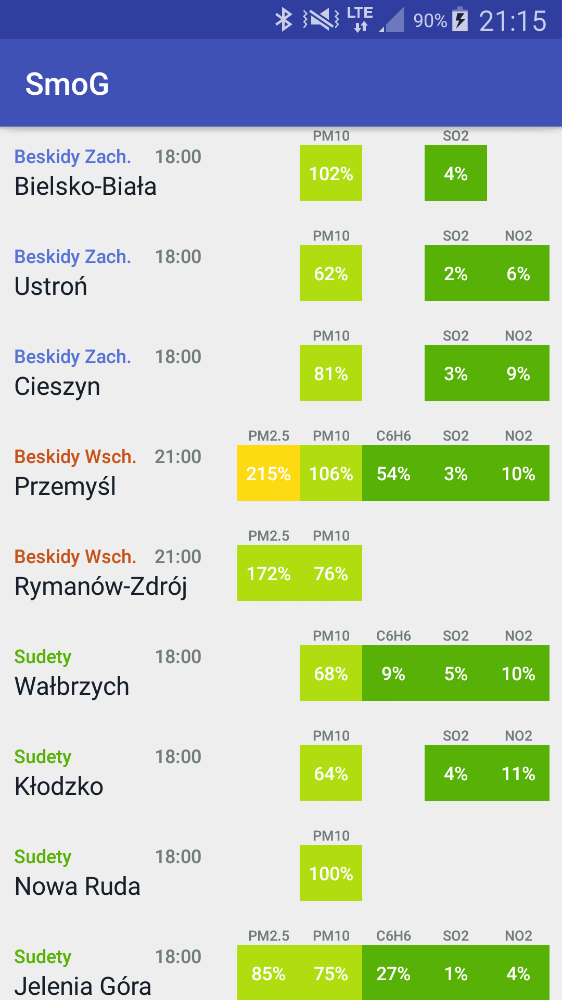

# SmoG

Android (Java) app that displays air quality (PM2.5, PM10, C6H6, SO2 and NO2 percentage deviations from the WHO/GIOŚ norms) in selected locations grouped by type (mountatin range). **SmoG** stems from Polish ***Smo**g w **G**órach* i.e. *Smog in Mountains* but any location listed in [GIOŚ](http://powietrze.gios.gov.pl/pjp/content/api) database may be used.

Three most harmful contaminants for human health (toxic benzene and particulate matter PM2.5 and PM10) are also plotted as a function of time (for three last days). Red dotted line (corresponding to 400%) indicates roughly the danger zone.

  
  

